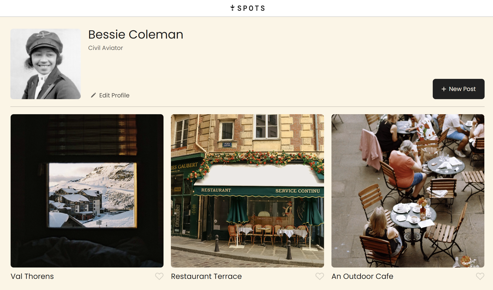
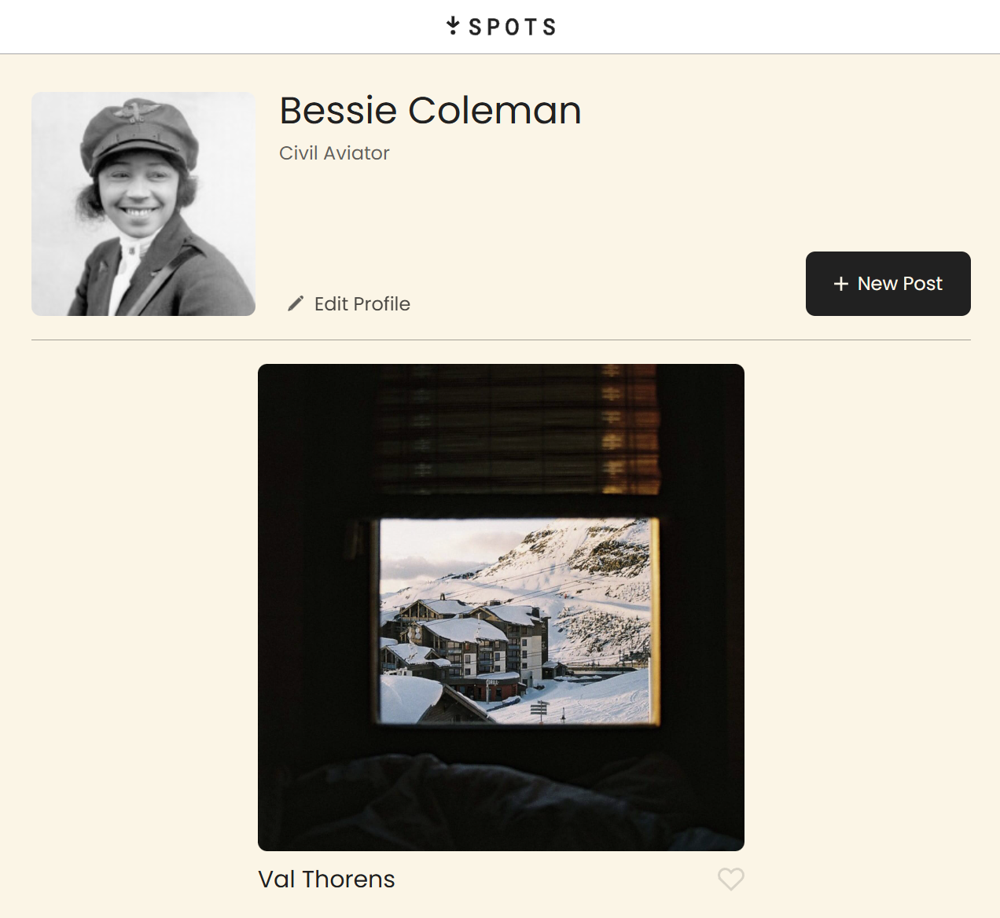
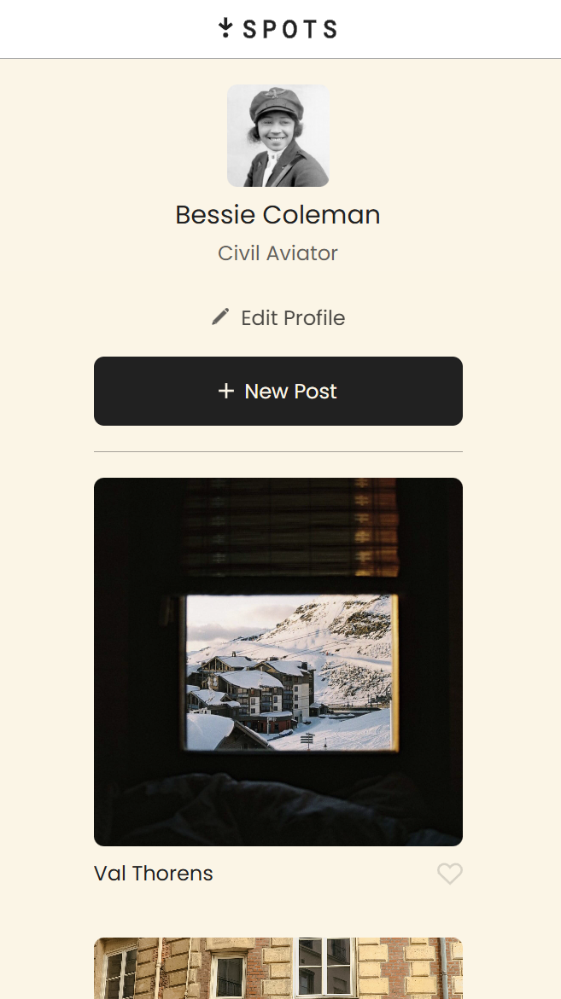

# Project 3: Spots

Social Media Web Application where you are able to edit your own profile, add few posts and like them.

## Technologies Used

- Computer with VS Code
- DOT from TripleTen
- TripleTen Material

## A Look Into...

## Website

Come visit our [Website](https://toriv16.github.io/se_project_spots/)

## Learn More Project Pitch

To learn more Watch [This Pitch](https://drive.google.com/file/d/1Z_19wfYg2OYHgHCswPkQ3oQXVMVAsUT0/view?usp=sharing). Here I will go over the basics and my Train of thoughts when working on this.
